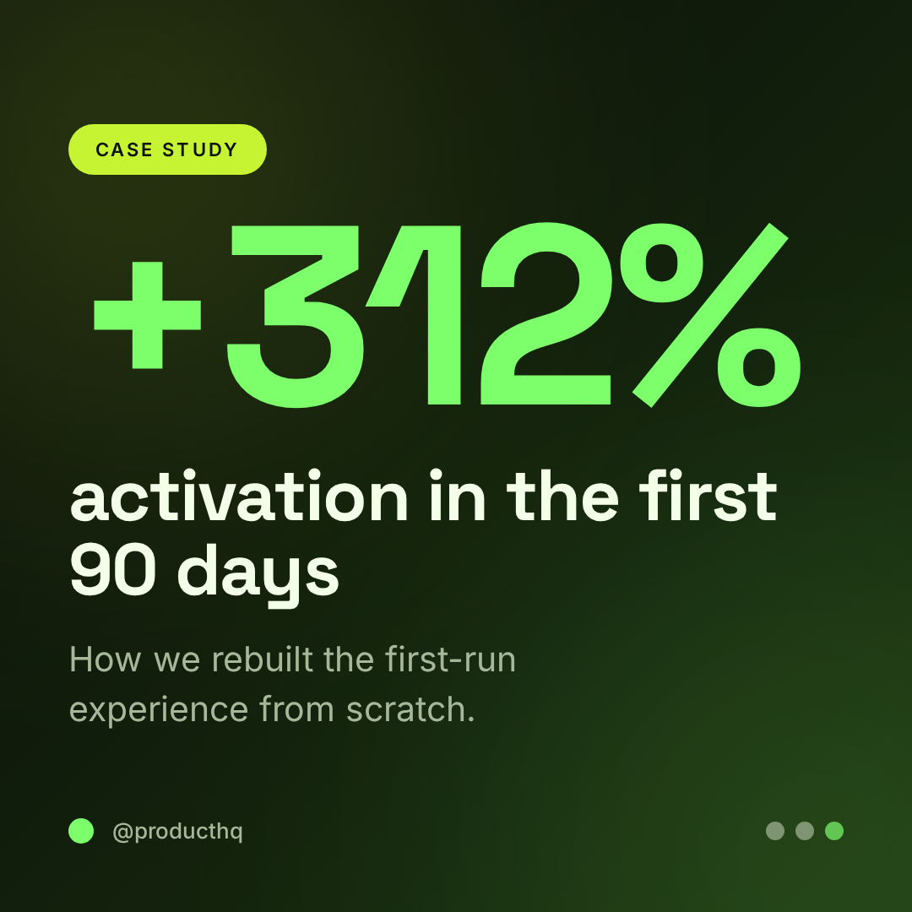
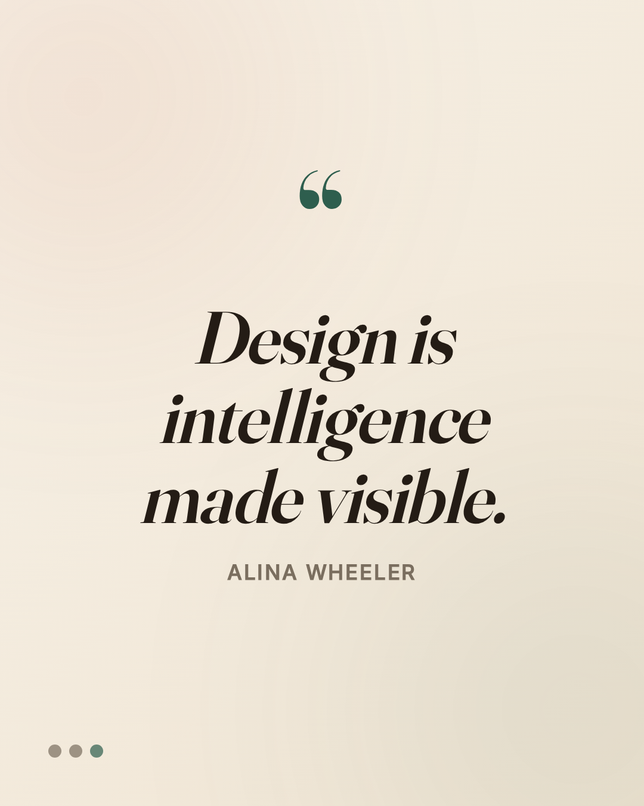
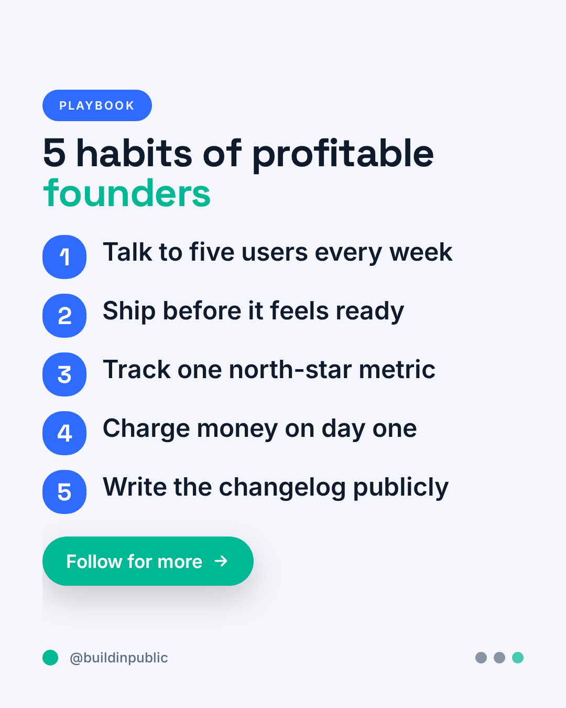

# PostBrain — an AI Brain for professional Instagram posts

> Fixes the real reason ChatGPT/DALL·E posts look amateur: **tiny fonts, dated
> colors, and weak layouts.** PostBrain separates *design decisions* (the Brain)
> from *pixel-perfect rendering* (HTML/CSS), so every post comes out looking like
> a real designer made it.

<p>
  
  
  
</p>

---

## Why AI-generated posts look bad (the root cause)

When you ask ChatGPT/DALL·E for an "Instagram post," an **image diffusion model**
paints the whole thing — including the text — as pixels. That model has:

- **no concept of a canvas or type scale** → text ends up tiny and inconsistent,
- **no design system** → colors are invented on the spot and look dated/muddy,
- **no layout grid** → spacing and hierarchy are weak.

No amount of prompting fully fixes this, because the model is *guessing pixels*.

## The fix: split the brain from the brush

Real design tools never let a diffusion model set type. PostBrain does the same:

```
 content brief ──▶  THE BRAIN  ──▶  design spec  ──▶  HTML/CSS RENDERER  ──▶  1080px PNG
   (plain text)   (design decisions)  (JSON)         (real fonts, exact colors)
```

1. **The Brain** (`src/brain/brain.js`) reads a plain brief and decides the
   layout, a modern palette, a font pairing, and the full type hierarchy — the
   same calls a human art director makes. It's deterministic per `seed`, so you
   can lock a look or explore variations.
2. **The Renderer** (`src/render/renderer.js`) draws the spec as a self-contained
   HTML document at exact Instagram pixels. Because text is **real HTML/CSS**, it
   is always large, crisp, correctly colored, and on a grid.
3. **The Exporter** (`src/render/export.js`) screenshots it to a ready-to-post PNG.

This is why the output structurally *cannot* have tiny fonts or random colors.

---

## Quickstart

Requires Node.js 18+.

```bash
npm install
npx playwright install chromium   # one-time, for PNG export

# Generate a post from flags
node cli.js \
  --headline "Stop guessing your macros" \
  --eyebrow "NUTRITION 101" \
  --subtext "A 60-second framework to hit your protein every single day." \
  --cta "Save this post" --handle "@fitwithsam" \
  --industry fitness --format portrait --out output/macros

# ...or from a JSON brief
node cli.js --json prompts/example-brief.json

# Build the full example gallery
npm run examples
```

Each run writes `<out>.html` (open in any browser) and `<out>.png`
(1080px, Instagram-ready) and prints the Brain's decisions:

```
Brain decisions:
  layout   : hero-centered (Centered hero)
  palette  : sage-calm (Sage Calm, light)
  fonts    : warm-humanist
  format   : portrait 1080x1350
```

Use `--no-png` to skip Chromium and just get the HTML.

---

## The brief (what you give it)

Only `headline` is required. Everything else sharpens the result.
Full schema: [`prompts/brief-schema.json`](./prompts/brief-schema.json).

| Field | Effect |
|------|--------|
| `headline` | the big line (≤ 8 words works best) |
| `eyebrow` | small kicker label above the headline |
| `subtext` | one supporting sentence |
| `bullets[]` | provide these → **numbered-list** layout |
| `stat{value,label}` | provide this → **big-number** layout |
| `cta`, `handle` | CTA pill + footer @handle |
| `industry` / `mood` | steer palette + fonts (e.g. `fitness`, `saas`, `wellness`, `ai`) |
| `format` | `square` (1:1) · `portrait` (4:5) · `story` (9:16) |
| `palette`, `layout`, `pairing` | hard overrides (see `src/design-system/`) |
| `seed` | reproducible variations |

The Brain picks the layout from the **shape** of your content: a lone line → hero,
a list → listicle, a single number → stat spotlight, a quotation → quote card.

---

## Design system (the taste, encoded)

Everything the Brain can choose lives in [`src/design-system/`](./src/design-system):

- **`palettes.js`** — 8 hand-tuned modern palettes with semantic roles
  (bg / text / muted / primary / accent) and guaranteed contrast.
- **`typography.js`** — 5 Google-Font pairings + a **canvas-relative** type scale.
  Sizes are fractions of the canvas width, so the headline is always ~90–150px.
- **`layouts.js`** — 5 proven layout archetypes.
- **`tokens.js`** — formats, spacing, radii, shadows.

Add your brand: drop a palette into `palettes.js` (or pass `--palette`) and a
font pairing into `typography.js`. No renderer changes needed.

---

## Using it straight from ChatGPT (no code)

If you'd rather keep working inside ChatGPT, paste
[`prompts/system-prompt.md`](./prompts/system-prompt.md) into a Custom GPT. It
encodes these same rules so ChatGPT outputs **HTML** (sharp text) instead of a
blurry image — or a **JSON brief** you feed to `node cli.js --json -` for a
guaranteed-consistent render.

---

## Project structure

```
src/
  design-system/   palettes, typography, layouts, tokens  (the "taste")
  brain/brain.js   brief -> design spec                    (the decisions)
  render/
    renderer.js    design spec -> standalone HTML          (pixel-perfect)
    export.js      HTML -> PNG via Playwright
cli.js             command-line entry point
scripts/build-examples.js
prompts/           ChatGPT system prompt + brief schema
examples/          generated gallery (see examples/README.md)
```

## Gallery

Eight posts, each generated from a one-line brief with zero manual design:
see [`examples/README.md`](./examples/README.md).

## License

MIT.
