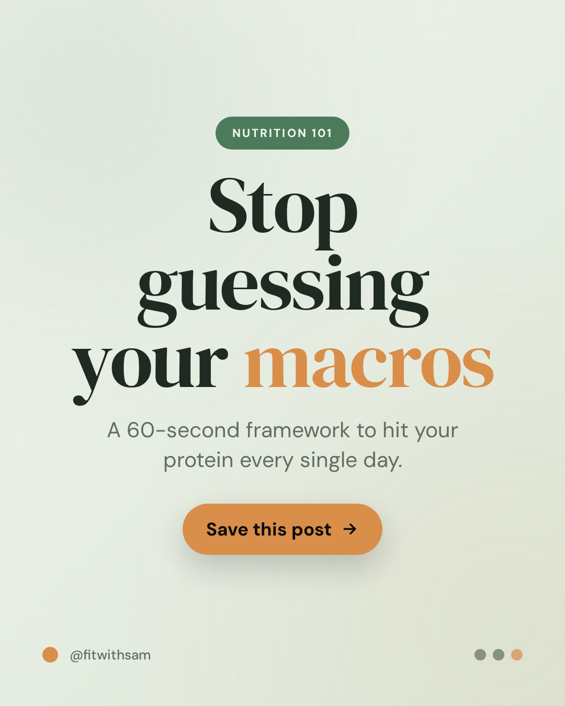
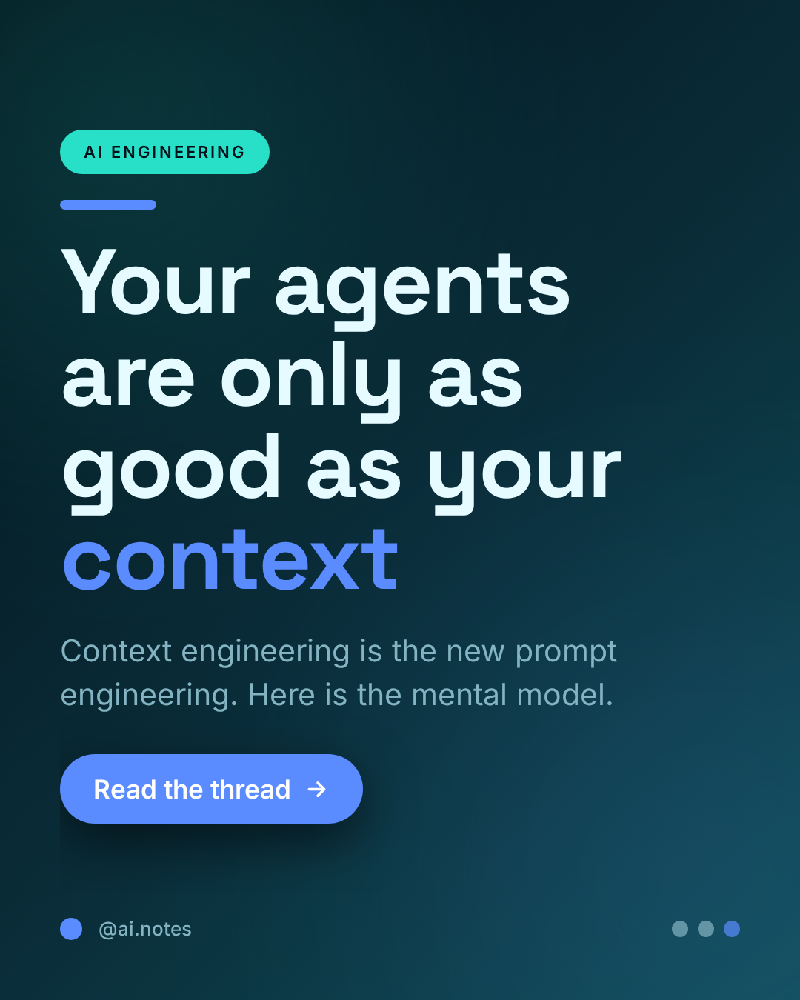
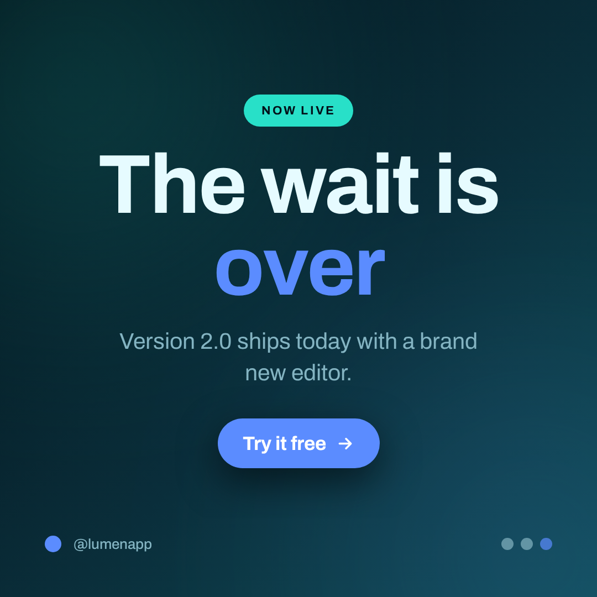
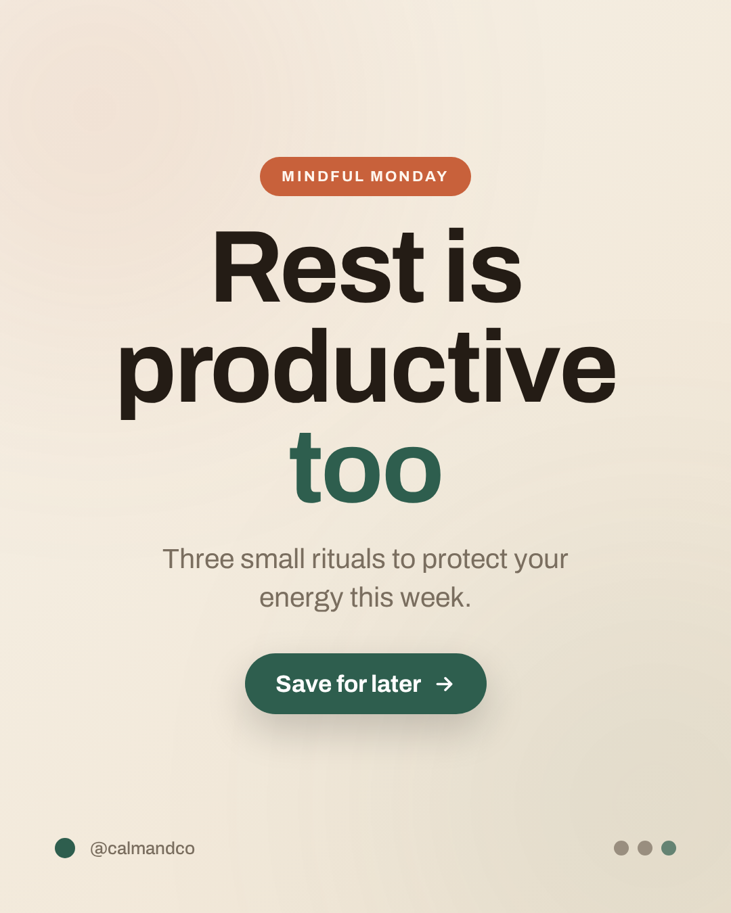
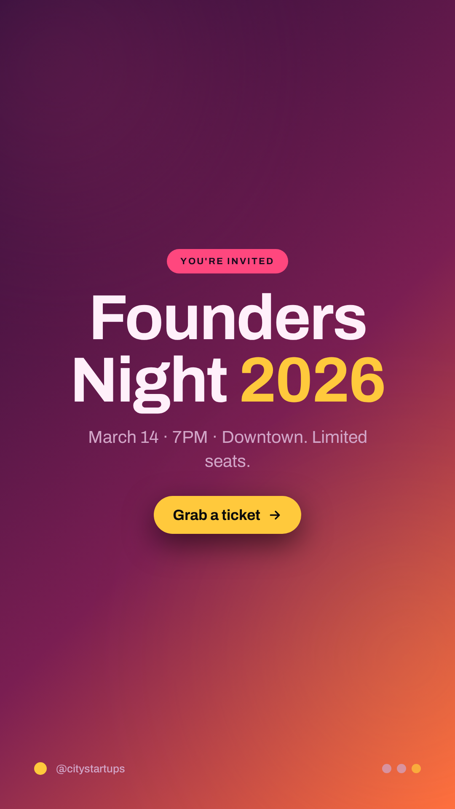

# Example gallery

Every image below was generated by the Brain from a plain text brief — no manual design.

### Stop guessing your macros

`hero-centered` · `sage-calm` · `warm-humanist` · `portrait`

### 5 habits of profitable founders

`listicle` · `clean-slate` · `grotesk-modern` · `portrait`

### Onboarding that converts

`stat-spotlight` · `midnight-lime` · `grotesk-modern` · `square`

### Design is intelligence made visible.

`quote-card` · `warm-editorial` · `editorial-serif` · `portrait`

### Your agents are only as good as your context

`editorial-left` · `electric-aqua` · `grotesk-modern` · `portrait`

### The wait is over

`hero-centered` · `electric-aqua` · `expressive-display` · `square`

### Rest is productive too

`hero-centered` · `warm-editorial` · `expressive-display` · `portrait`

### Founders Night 2026

`hero-centered` · `sunset-pop` · `expressive-display` · `story`

